# UML 1 — Use Case Diagram

## Overview

This Use Case Diagram documents the functional capabilities of **The Tirumala Verse** application based strictly on its current production implementation. It specifies the interactions between primary actors and system functionalities across both public devotee features and administration operations.

```mermaid
graph LR
    classDef actor fill:#f9f9f9,stroke:#333,stroke-width:2px,font-weight:bold;
    classDef usecase fill:#e1f5fe,stroke:#0288d1,stroke-width:1.5px;
    classDef adminusecase fill:#fff3e0,stroke:#f57c00,stroke-width:1.5px;

    Devotee(("Devotee / Public User")):::actor
    Admin(("Administrator")):::actor

    subgraph Calendar_Package ["Calendar & Events"]
        UC_BrowseCalendar(["Browse Festival Calendar"]):::usecase
        UC_NavMonths(["Navigate Months"]):::usecase
        UC_FilterTemple(["Filter Events by Temple"]):::usecase
        UC_SearchEvents(["Search Events"]):::usecase
        UC_ViewEventDetails(["View Event Details"]):::usecase
        UC_ViewEventImages(["View Event Images"]):::usecase
        UC_ViewEventSignificance(["View Event Significance / Vahanam"]):::usecase
        UC_ShareEvent(["Share Event"]):::usecase
        UC_ExportGoogle(["Export Event to Google Calendar"]):::usecase
        UC_ExportWhatsApp(["Export Event to WhatsApp"]):::usecase
        UC_ExportPDF(["Export Schedule as PDF"]):::usecase
        UC_ExportICal(["Export Schedule as iCalendar"]):::usecase
    end

    subgraph Sevas_Package ["Daily & Weekly Sevas"]
        UC_ViewNityaSevas(["View Daily Nitya Sevas"]):::usecase
        UC_ViewWeeklySevas(["View Weekly / Periodical Sevas"]):::usecase
    end

    subgraph Tokens_Package ["SSD / DD Tokens"]
        UC_ViewTokenStatus(["View SSD/DD Token Status"]):::usecase
        UC_ViewTokenHistory(["View Token History"]):::usecase
        UC_ViewTokenLocations(["View Token Issuance Locations"]):::usecase
        UC_ViewTokenReqs(["View Token Requirements"]):::usecase
    end

    subgraph Glossary_Package ["Utsavam Glossary"]
        UC_BrowseGlossary(["Browse Utsavam Glossary"]):::usecase
        UC_SearchGlossary(["Search Glossary"]):::usecase
        UC_FilterGlossaryCat(["Filter Glossary Categories"]):::usecase
    end

    subgraph Personalization_Package ["Personalization & Media"]
        UC_SwitchLang(["Switch Language"]):::usecase
        UC_SwitchTheme(["Switch Theme"]):::usecase
        UC_WatchLive(["Watch TTD Live"]):::usecase
    end

    subgraph Feedback_Package ["Community Feedback"]
        UC_SubmitFeedback(["Submit Community Feedback"]):::usecase
        UC_CompleteCaptcha(["Complete CAPTCHA"]):::usecase
        UC_AttachScreenshot(["Attach Screenshot to Feedback"]):::usecase
    end

    subgraph Notifications_Package ["Web Push Notifications"]
        UC_SubscribePush(["Subscribe to Web Push Notifications"]):::usecase
        UC_UnsubscribePush(["Unsubscribe from Web Push Notifications"]):::usecase
    end

    subgraph Admin_Package ["Administration"]
        UC_AdminAuth(["Authenticate as Administrator"]):::adminusecase
        UC_ManageEvents(["Manage Temple Events"]):::adminusecase
        UC_AddEvent(["Add Event"]):::adminusecase
        UC_EditEvent(["Edit Event"]):::adminusecase
        UC_DeleteEvent(["Delete Event"]):::adminusecase
        UC_ManageGlossary(["Manage Glossary"]):::adminusecase
        UC_AddGlossary(["Add Glossary Term"]):::adminusecase
        UC_EditGlossary(["Edit Glossary Term"]):::adminusecase
        UC_DeleteGlossary(["Delete Glossary Term"]):::adminusecase
        UC_ManageFeedback(["Manage Community Feedback"]):::adminusecase
        UC_ReviewFeedback(["Review Feedback"]):::adminusecase
        UC_UpdateFeedbackStatus(["Update Feedback Status"]):::adminusecase
        UC_AddAdminNotes(["Add Admin Notes"]):::adminusecase
        UC_DeleteFeedback(["Delete Feedback"]):::adminusecase
        UC_ExportFeedbackCSV(["Export Feedback CSV"]):::adminusecase
        UC_ManagePush(["Manage Web Push Notifications"]):::adminusecase
        UC_ViewSubCount(["View Subscriber Count"]):::adminusecase
        UC_CreateCustomNotif(["Create Custom Notification"]):::adminusecase
        UC_ViewNotifHistory(["View Notification History / Metrics"]):::adminusecase
        UC_ManageTokens(["Manage Token Data / Overrides"]):::adminusecase
    end

    %% Devotee Primary Associations
    Devotee --> UC_BrowseCalendar
    Devotee --> UC_ExportPDF
    Devotee --> UC_ExportICal
    Devotee --> UC_ViewNityaSevas
    Devotee --> UC_ViewWeeklySevas
    Devotee --> UC_ViewTokenStatus
    Devotee --> UC_ViewTokenHistory
    Devotee --> UC_ViewTokenLocations
    Devotee --> UC_ViewTokenReqs
    Devotee --> UC_BrowseGlossary
    Devotee --> UC_SwitchLang
    Devotee --> UC_SwitchTheme
    Devotee --> UC_WatchLive
    Devotee --> UC_SubmitFeedback
    Devotee --> UC_SubscribePush
    Devotee --> UC_UnsubscribePush

    %% Devotee <<include>> and <<extend>> Relationships
    UC_BrowseCalendar -.->|"<<include>>"| UC_NavMonths
    UC_BrowseCalendar -.->|"<<include>>"| UC_FilterTemple
    UC_BrowseCalendar -.->|"<<include>>"| UC_SearchEvents
    UC_BrowseCalendar -.->|"<<include>>"| UC_ViewEventDetails

    UC_ViewEventDetails -.->|"<<include>>"| UC_ViewEventImages
    UC_ViewEventDetails -.->|"<<include>>"| UC_ViewEventSignificance

    UC_ShareEvent -.->|"<<extend>>"| UC_ViewEventDetails
    UC_ExportGoogle -.->|"<<extend>>"| UC_ViewEventDetails
    UC_ExportWhatsApp -.->|"<<extend>>"| UC_ViewEventDetails

    UC_BrowseGlossary -.->|"<<include>>"| UC_SearchGlossary
    UC_BrowseGlossary -.->|"<<include>>"| UC_FilterGlossaryCat

    UC_SubmitFeedback -.->|"<<include>>"| UC_CompleteCaptcha
    UC_AttachScreenshot -.->|"<<extend>>"| UC_SubmitFeedback

    %% Admin Primary Associations & Session Inclusion
    Admin --> UC_AdminAuth

    UC_AdminAuth -.->|"<<include>>"| UC_ManageEvents
    UC_AdminAuth -.->|"<<include>>"| UC_ManageGlossary
    UC_AdminAuth -.->|"<<include>>"| UC_ManageFeedback
    UC_AdminAuth -.->|"<<include>>"| UC_ManagePush
    UC_AdminAuth -.->|"<<include>>"| UC_ManageTokens

    UC_ManageEvents -.->|"<<include>>"| UC_AddEvent
    UC_ManageEvents -.->|"<<include>>"| UC_EditEvent
    UC_ManageEvents -.->|"<<include>>"| UC_DeleteEvent

    UC_ManageGlossary -.->|"<<include>>"| UC_AddGlossary
    UC_ManageGlossary -.->|"<<include>>"| UC_EditGlossary
    UC_ManageGlossary -.->|"<<include>>"| UC_DeleteGlossary

    UC_ManageFeedback -.->|"<<include>>"| UC_ReviewFeedback
    UC_ManageFeedback -.->|"<<include>>"| UC_UpdateFeedbackStatus
    UC_ManageFeedback -.->|"<<include>>"| UC_AddAdminNotes
    UC_ManageFeedback -.->|"<<include>>"| UC_DeleteFeedback
    UC_ManageFeedback -.->|"<<include>>"| UC_ExportFeedbackCSV

    UC_ManagePush -.->|"<<include>>"| UC_ViewSubCount
    UC_ManagePush -.->|"<<include>>"| UC_CreateCustomNotif
    UC_ManagePush -.->|"<<include>>"| UC_ViewNotifHistory
```

---

## Detailed Use Case Description

### 1. Devotee / Public User
The **Devotee / Public User** represents any visitor interacting with the public-facing features of The Tirumala Verse. No login or authentication is required for public operations.

### 2. Administrator
The **Administrator** represents authorized temple management staff who log in using secure credentials via Supabase Authentication. A single authenticated session grants access to all administrative management features without requiring separate authentication per action.

### 3. Main Public Functionality
* **Calendar & Events**: Devotees browse a 16-month festival grid (Jan 2026 – Apr 2027), navigate across months, apply temple filters, search festival titles and descriptions, view event detail popups, view image galleries and ritual significance, share events on social media, generate 1-click Google Calendar entries, format WhatsApp messages, and export complete festival schedules as PDF or `.ics` iCalendar files.
* **Daily & Weekly Sevas**: Devotees view daily Tirumala timetables (Suprabhatam, Thomala, Archana, Ekanta Seva) and weekly special sevas (Abhishekam, Vishesha Puja, etc.).
* **SSD / DD Tokens**: Devotees inspect live Sarva Darshan and Divya Darshan token status, 7-day token issuance history, Tirupati issuance locations, and pilgrim guidelines.
* **Utsavam Glossary**: Devotees browse cultural terms, search keywords, and filter by categories in English and Telugu.
* **Personalization & Media**: Devotees switch between English and Telugu, toggle Light/Dark visual themes, and watch official TTD live stream coverage.
* **Community Feedback**: Devotees submit feedback by completing a visual CAPTCHA and optionally attaching a screenshot image.
* **Web Push Notifications**: Devotees opt-in or opt-out of background Web Push alerts for upcoming festivals and updates.

### 4. Main Administrative Functionality
* **Authentication**: Secure email/password login via Supabase Auth.
* **Event Management**: Add, edit, or delete temple events synced across client browsers.
* **Glossary Management**: Add, edit, or delete cultural glossary terms in the cloud database.
* **Feedback Management**: Review submitted feedback, update processing status (New, Under Review, Planned, In Progress, Completed, Rejected), attach admin resolution notes, delete entries, and export feedback data as CSV.
* **Push Notification Management**: View active push subscriber counts, compose and broadcast custom push notifications, and monitor delivery/deactivation metrics.
* **Token Management**: Inspect and override token day records and status observations.

### 5. Important Include / Extend Relationships
* **Includes (`<<include>>`)**:
  * *Browse Festival Calendar* mandatory steps: *Navigate Months*, *Filter Events by Temple*, *Search Events*, and *View Event Details*.
  * *View Event Details* mandatory sub-views: *View Event Images* and *View Event Significance / Vahanam*.
  * *Submit Community Feedback* requires: *Complete CAPTCHA*.
  * *Authenticate as Administrator* unlocks: *Manage Temple Events*, *Manage Glossary*, *Manage Community Feedback*, *Manage Web Push Notifications*, and *Manage Token Data / Overrides*.
  * Functional packages (*Manage Temple Events*, *Manage Glossary*, *Manage Community Feedback*, *Manage Web Push Notifications*) include their respective CRUD and metric operations.
* **Extends (`<<extend>>`)**:
  * *Share Event*, *Export Event to Google Calendar*, and *Export Event to WhatsApp* extend the base *View Event Details* use case.
  * *Attach Screenshot to Feedback* optionally extends *Submit Community Feedback*.

> [!NOTE]
> **Diagnostic Privacy Guarantee**: Community Feedback does not automatically collect browser, operating system, device, user-agent, or page-URL diagnostics.
