# UML 2 — Entity Relationship (ER) Diagram

## Overview

This Entity Relationship (ER) Diagram documents the backend data architecture of **The Tirumala Verse** based strictly on the current Supabase PostgreSQL database implementation. It details actual database tables, primary keys, attributes, foreign keys, unique constraints, and logical application-level associations.

```mermaid
erDiagram
    %% Entities Definition

    auth_users {
        uuid id PK "Supabase Managed Auth User ID"
        string email "Admin Email Address"
        timestamp created_at "Account Creation Timestamp"
    }

    events {
        string id PK "Unique Event ID (e.g. ttd-2026-09-17)"
        string title "Event Title in English"
        string title_te "Event Title in Telugu"
        string temple_id "Logical Temple Identifier"
        string start_date "Start Date (YYYY-MM-DD)"
        string end_date "End Date (YYYY-MM-DD)"
        string category "Category (special-puja, brahmotsavam, etc.)"
        string vahanam "Vahanam / Vehicle Name"
        string description "English Description"
        string description_te "Telugu Description"
        string image_url "Primary Banner Image URL"
        jsonb images "Gallery Images Metadata Array"
    }

    glossary {
        string id PK "Unique Term Slug / Identifier"
        string title "Ritual / Festival Name in English"
        string title_te "Ritual / Festival Name in Telugu"
        string meaning "Literal Meaning in English"
        string meaning_te "Literal Meaning in Telugu"
        string description "Detailed Significance Description"
        string description_te "Telugu Significance Description"
        string category "Glossary Category"
        jsonb images "Associated Image Assets Array"
        timestamp created_at "Record Creation Timestamp"
        timestamp updated_at "Record Update Timestamp"
    }

    token_days {
        uuid_or_bigint id PK "Unique Token Day Session ID"
        string issuance_date UK "Issuance Date (YYYY-MM-DD)"
        string darshan_date "Target Darshan Date (YYYY-MM-DD)"
        string issuance_status "Session Status (active, no_issuance)"
        timestamp issuance_started_at "Token Issuance Start Timestamp"
        timestamp ssd_completed_at "SSD Quota Exhausted Timestamp"
        timestamp dd_completed_at "DD Quota Exhausted Timestamp"
        integer ssd_quota "Total SSD Quota Count"
        integer dd_quota "Total DD Quota Count"
        string ssd_status "SSD Status (active, completed)"
        string dd_status "DD Status (active, completed)"
        string source_type "Ingestion Source (telegram, manual)"
        string source_reference "Source Reference (e.g. telegram:123)"
        string notes "Administrative Notes"
    }

    token_observations {
        uuid_or_bigint id PK "Unique Observation Snapshot ID"
        uuid_or_bigint token_day_id FK "Logical Reference to token_days.id"
        timestamp observed_at "Observation Snapshot Timestamp"
        integer ssd_remaining "Remaining SSD Tokens Count"
        integer dd_remaining "Remaining DD Tokens Count"
        string ssd_status "SSD Status Snapshot"
        string dd_status "DD Status Snapshot"
        string source_type "Ingestion Source (telegram, manual)"
        string source_reference UK "Unique Ingestion Source Ref (telegram:msg_id)"
        string raw_text "Raw Source Message Text"
    }

    push_subscriptions {
        uuid id PK "Unique Subscription ID"
        string endpoint UK "Browser Push Service Endpoint URI"
        string p256dh "P-256 Public Encryption Key"
        string auth "Push Authentication Secret"
        string user_agent "Client Browser User Agent String"
        boolean is_active "Active Subscription Flag"
        integer failure_count "Consecutive Delivery Failure Counter"
        timestamp last_success_at "Last Successful Delivery Timestamp"
        timestamp created_at "Registration Timestamp"
        timestamp updated_at "Last State Update Timestamp"
    }

    notification_dispatch_logs {
        uuid id PK "Unique Dispatch Log ID"
        uuid subscription_id FK "References push_subscriptions.id (ON DELETE CASCADE)"
        string notification_type "Notification Category (admin_custom)"
        string entity_id "Associated Notification Entity ID"
        timestamp dispatched_at "Dispatch Claim Timestamp"
    }

    admin_custom_notifications {
        uuid id PK "Unique Custom Notification ID"
        uuid created_by FK "References auth.users.id"
        string title "Notification Headline"
        string body "Notification Message Body"
        string url "Target Destination URL"
        string status "Status (pending, dispatching, completed, failed)"
        timestamp created_at "Notification Creation Timestamp"
        timestamp dispatched_at "Outbox Processing Start Timestamp"
        integer recipient_count "Total Active Recipients Count"
        integer success_count "Successful Delivery Count"
        integer failure_count "Failed Delivery Count"
        integer deactivated_count "Deactivated Dead Subscription Count"
    }

    %% Relationships

    auth_users ||--o{ admin_custom_notifications : "created_by (Actual DB Foreign Key)"
    push_subscriptions ||--o{ notification_dispatch_logs : "subscription_id (Actual DB FK - ON DELETE CASCADE)"
    token_days ||--o{ token_observations : "token_day_id (Logical Application Relationship)"
```

---

## Relationships

### 1. Actual Database Foreign Keys
* **`push_subscriptions ──< notification_dispatch_logs`**
  * **FK Constraint**: `notification_dispatch_logs.subscription_id REFERENCES public.push_subscriptions(id) ON DELETE CASCADE`
  * **Cardinality**: `1` active Push Subscription to `0..N` Notification Dispatch Logs.
  * **Behavior**: Deleting a subscriber record automatically cascades and purges all associated atomic dispatch logs.
* **`auth.users ──< admin_custom_notifications`**
  * **FK Constraint**: `admin_custom_notifications.created_by REFERENCES auth.users(id)`
  * **Cardinality**: `1` Authenticated Admin User to `0..N` Broadcast Notifications.
  * **Behavior**: Links custom outbox notification records directly to the authenticated Supabase administrator identity (`auth.users`).

### 2. Logical / Application-Level Relationships
* **`token_days ──< token_observations`**
  * **Logical Link**: `token_observations.token_day_id` maps to `token_days.id`.
  * **Cardinality**: `1` Token Day Session to `0..N` Time-Series Token Observations.
  * **Note**: Maintained at the application and script layer (`telegram-poll.mjs`, `AdminTokenManager.jsx`) to associate periodic token snapshots with a daily token issuance session.
* **`events.temple_id` (No Database Foreign Key)**:
  * `events.temple_id` is a plain `TEXT` column storing string codes (e.g. `'tirumala-main'`, `'tiruchanur'`, `'kodandarama'`). It maps logically to static frontend temple metadata in `src/data/templeEvents.js`. There is **no database `temples` table** and **no foreign key constraint**.

---

## Architecture Notes

* **Community Feedback Privacy & Storage**: Devotee community feedback is stored strictly in client browser `localStorage` (`tirumala_feedback_submissions`). It is **not** stored as a Supabase database table and does **not** collect browser, operating system, device, user-agent, or page-URL diagnostics.
* **Push Subscription Security Boundary**: `push_subscriptions` and `notification_dispatch_logs` enforce strict Row Level Security (RLS) denying direct anon/authenticated client access. Subscriptions are created and deactivated exclusively via hardened `SECURITY DEFINER` RPC functions (`register_push_subscription`, `unsubscribe_push_subscription`).
* **Admin Notification Authorization**: `admin_custom_notifications` contains a foreign key to `auth.users(id)` and RLS policies restricting read/write access to the authorized admin account (`auth.uid() = '7cf7f7f7-7216-4296-8ab3-bb4a78a4b7db'` or `admin@thetirumalaverse.in`).
* **Static Frontend Data Separation**: Application data such as temple listings, Nitya Seva timetables, and static fallback events are maintained in frontend JS bundles, avoiding unnecessary database bloat.
