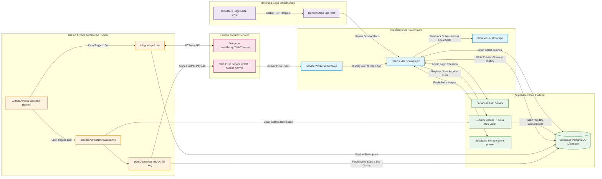

# UML 3 — Component Diagram

## Overview

This Component Diagram visualizes the high-level software architecture, module boundaries, component responsibilities, data sources, and system integration pipelines of **The Tirumala Verse** application based strictly on its production implementation.

---

## Component Responsibility Table

| Component | Layer / Environment | Primary Responsibility |
| :--- | :--- | :--- |
| **`App.jsx` (React SPA)** | Client Browser | Root UI orchestrator managing tab routing, language/theme state, modal dialogs, and component lifecycle. |
| **`public/sw.js` (Service Worker)** | Client Browser | Background Service Worker handling app shell pre-caching, `push` event listening, notification display, and `notificationclick` deep linking. |
| **Browser `LocalStorage`** | Client Browser | Client-side persistent storage for devotee feedback submissions (`tirumala_feedback_submissions`), local glossary overrides, and user UI preferences. |
| **Cloudflare** | Edge CDN / DNS | Edge distribution layer providing SSL termination, DDOS mitigation, and CDN caching for `https://thetirumalaverse.in/`. |
| **Render** | Static Hosting | Static web site hosting platform serving the compiled Vite React frontend application (`dist/`) and SPA client routing fallbacks. |
| **Supabase Auth** | Supabase Cloud | Managed authentication service validating administrator email/password logins and maintaining secure Auth sessions. |
| **Supabase PostgreSQL** | Supabase Cloud | Managed database storing events, glossary terms, token days, token observations, push subscriptions, dispatch logs, and admin notifications outbox. |
| **Supabase RPC & RLS Layer** | Supabase Cloud | Security Definer functions and Row Level Security policies protecting table access and encapsulating subscription management. |
| **Supabase Storage** | Supabase Cloud | Cloud storage bucket (`event-photos`) hosting high-resolution festival and deity image assets. |
| **GitHub Actions Runner** | Automation | Cloud workflow execution environment running scheduled cron tasks (`telegram-token-poll.yml` every 10 minutes and `supabase-backup.yml` daily at 02:00 UTC). |
| **`telegram-poll.mjs`** | Node.js / Automation | Automated script polling Telegram via MTProto, parsing structured SSD/DD token counts, and upserting records into Supabase `token_days` and `token_observations`. |
| **`processAdminNotifications.mjs`** | Node.js / Automation | Outbox processor script fetching pending custom admin notifications, claiming rows atomically via RPC, and calling the push dispatcher module. |
| **`pushDispatcher.mjs`** | Node.js / Automation | Server-side Web Push module handling VAPID cryptographic signing, atomic dispatch logging (`notification_dispatch_logs`), push service transmission, and dead subscription cleanup. |
| **Telegram (`LaxmiTeluguTechChannel`)** | External Service | Remote Telegram broadcast channel acting as the raw data source for live Tirupati token updates. |
| **Web Push Gateways** | External Service | Browser vendor push infrastructure (Google FCM, Mozilla Push Service, Apple APNs) routing encrypted push payloads to client devices. |

---

## Architecture & Data Control Flows

### 1. Public User Flow
`Devotee Browser` ──> `Cloudflare` ──> `Render` ──> `React / Vite SPA` ──(Anon REST Query)──> `Supabase Database & Storage`

Public visitors load the application assets from Render via Cloudflare. Read-only queries for events, glossary terms, and token status execute against the Supabase database via the public anonymous API key.

### 2. Token Data Flow (Independent Pipeline)
`GitHub Actions` ──> `telegram-poll.mjs` ──(MTProto)──> `Telegram Channel` ──(Service Role Key)──> `Supabase token_days & token_observations` ──(Public SELECT)──> `Frontend Token UI`

Every 10 minutes, GitHub Actions runs `telegram-poll.mjs`. The script connects to Telegram via MTProto, parses raw text updates, and upserts token data into Supabase using the server Service Role Key. The frontend queries these tables on page load and auto-refreshes every 10 minutes.

> [!IMPORTANT]
> **Pipeline Independence**: Token ingestion and Web Push notification processing are completely independent pipelines. Token observations do NOT automatically trigger Web Push notifications.

### 3. Admin Web Push Flow (Independent Pipeline)
`Admin Portal` ──(Auth Session)──> `admin_custom_notifications` ──> `GitHub Actions` ──> `processAdminNotifications.mjs` ──> `pushDispatcher.mjs (VAPID Key)` ──> `Web Push Gateways` ──> `Service Worker (public/sw.js)` ──> `Devotee Device Banner`

The administrator creates a custom notification record in the `admin_custom_notifications` outbox table (status: `'pending'`). The scheduled GitHub Actions runner executes `processAdminNotifications.mjs`, which claims pending rows via RPC `claim_admin_notification` and invokes `pushDispatcher.mjs`. The dispatcher signs payloads with the server-side VAPID private key, logs claims in `notification_dispatch_logs`, transmits payloads to browser push gateways, and cleans up dead subscriptions. Receiving browsers trigger `public/sw.js` to display the banner alert.

### 4. Admin Authentication Flow
`Administrator` ──(Credentials)──> `Supabase Auth (signInWithPassword)` ──(JWT Session)──> `Protected Admin Portal Operations`

Admin authentication is managed by Supabase Auth (`useAdmin.js`). A valid JWT session unlocks admin UI management panels and satisfies Supabase RLS policy checks for database write operations.

---

## Architecture & Privacy Notes

* **Community Feedback Privacy & Storage**: Devotee community feedback is submitted and stored strictly inside client browser `LocalStorage` (`tirumala_feedback_submissions`). It is **not** stored as a Supabase database table and does **not** automatically collect browser, operating system, device, user-agent, or page-URL diagnostics.
* **Dormant Script Status**: `telegram-worker.mjs` is a persistent daemon polling script containing local file checkpointing (`.telegram-checkpoint.json`). It is **dormant and not deployed** in production. Production token polling is handled exclusively by the stateless `telegram-poll.mjs` script executed via GitHub Actions cron.
* **VAPID Key Isolation**: The VAPID private key (`VAPID_PRIVATE_KEY`) is stored exclusively as an encrypted secret in GitHub Actions and is never exposed to the client browser. The VAPID public key (`VITE_VAPID_PUBLIC_KEY`) is used client-side solely to generate valid `PushSubscription` keys.
