# UML 4 — Deployment Diagram

## Overview

This Deployment Diagram visualizes the physical, cloud, and edge infrastructure topology of **The Tirumala Verse** application based strictly on its production environment. It maps client runtime environments, hosting platforms, database infrastructure, automated CI/CD runners, external service gateways, protocol links, and security boundaries.

```mermaid
flowchart TB
    classDef client fill:#e1f5fe,stroke:#0288d1,stroke-width:1.5px;
    classDef edge fill:#ede7f6,stroke:#512da8,stroke-width:1.5px;
    classDef cloud fill:#e8f5e9,stroke:#388e3c,stroke-width:1.5px;
    classDef runner fill:#fff3e0,stroke:#f57c00,stroke-width:1.5px;
    classDef external fill:#fce4ec,stroke:#c2185b,stroke-width:1.5px;

    subgraph Client_Device ["Devotee / Admin Client Device"]
        Browser_Node["Web Browser Engine"]:::client
        SPA_Node["React / Vite Static App dist/"]:::client
        SW_Node["Service Worker public/sw.js"]:::client
        LocalStorage_Node["Browser LocalStorage"]:::client
    end

    subgraph Edge_Infrastructure ["Edge & Hosting Layer"]
        Cloudflare_CDN["Cloudflare Edge CDN / DNS https://thetirumalaverse.in"]:::edge
        Render_Host["Render Static Web Host dist/ & _redirects"]:::edge
    end

    subgraph Supabase_Cloud_Platform ["Supabase Cloud Platform"]
        Supa_Auth_Svc["Supabase Auth Engine auth.users"]:::cloud
        Supa_PostgreSQL[(Supabase Managed PostgreSQL DB)]:::cloud
        Supa_RLS_RPC["Security Definer RPCs & RLS Security Layer"]:::cloud
        Supa_Bucket["Supabase Storage Bucket event-photos"]:::cloud
    end

    subgraph GitHub_Actions_Platform ["GitHub Actions Runner Environment Ubuntu"]
        GHA_Poll_Workflow["telegram-token-poll.yml Workflow"]:::runner
        Script_Poll_Node["telegram-poll.mjs Node 22"]:::runner
        Script_AdminPush_Node["processAdminNotifications.mjs & pushDispatcher.mjs"]:::runner
        GHA_Backup_Workflow["supabase-backup.yml Workflow"]:::runner
    end

    subgraph External_Service_Infrastructure ["External Infrastructure Gateways"]
        Telegram_Servers["Telegram MTProto Servers LaxmiTeluguTechChannel"]:::external
        Push_Gateways["Web Push Gateways FCM / Mozilla / APNs"]:::external
    end

    %% Public Web Delivery Flow
    Browser_Node -->|1. HTTPS Request| Cloudflare_CDN
    Cloudflare_CDN -->|2. Proxy & Edge Cache| Render_Host
    Render_Host -->|3. Serves Static Vite Assets| SPA_Node
    SPA_Node -->|4. Registers SW| SW_Node

    %% Client Data & Auth Interactions
    SPA_Node <-->|HTTPS REST Anon Key| Supa_PostgreSQL
    SPA_Node <-->|HTTPS Asset Fetch| Supa_Bucket
    SPA_Node <-->|HTTPS Auth Session| Supa_Auth_Svc
    SPA_Node -->|RPC register/unsubscribe| Supa_RLS_RPC
    Supa_RLS_RPC -->|Update Subscriptions| Supa_PostgreSQL
    SPA_Node -->|Feedback & Local State| LocalStorage_Node

    %% Token Ingestion Flow (Independent Pipeline)
    GHA_Poll_Workflow -->|Cron Trigger 10m| Script_Poll_Node
    Script_Poll_Node <-->|MTProto API over TLS| Telegram_Servers
    Script_Poll_Node -->|HTTPS Service Role Key| Supa_PostgreSQL

    %% Admin Custom Push Outbox Flow (Independent Pipeline)
    GHA_Poll_Workflow -->|Cron Trigger 10m| Script_AdminPush_Node
    Script_AdminPush_Node -->|HTTPS Claim & Dispatch Logs| Supa_PostgreSQL
    Script_AdminPush_Node -->|HTTPS Signed VAPID Payload| Push_Gateways
    Push_Gateways -->|Web Push Encrypted Protocol| SW_Node
    SW_Node -->|Push Alert & Navigation| SPA_Node

    %% Backup Pipeline
    GHA_Backup_Workflow -->|Daily Cron 02:00 UTC db dump| Supa_PostgreSQL
```

---

## Deployment Node Inventory

| Deployment Node | Runs / Hosts | Purpose & Hosting Environment |
| :--- | :--- | :--- |
| **Devotee / Admin Client Device** | Web Browser Engine | Runs the compiled React/Vite Single Page Application, background Service Worker (`public/sw.js`), and manages client `LocalStorage`. |
| **Cloudflare** | Edge CDN & DNS | Provides edge DNS resolution, SSL/TLS termination, DDOS mitigation, and static asset caching for `https://thetirumalaverse.in/`. |
| **Render** | Static Site Host | Hosts static production build artifacts (`dist/`) generated by Vite, serving HTML/JS/CSS assets with SPA wildcard rewrite rules (`public/_redirects`). |
| **Supabase Cloud** | Managed Cloud BaaS | Hosts the PostgreSQL database, Supabase Auth service (`auth.users`), RLS security policies, RPC functions, and `event-photos` storage bucket. |
| **GitHub Actions Runner** | Ubuntu Cloud Runner | Automated serverless runner executing scheduled workflows (`telegram-token-poll.yml` every 10 minutes and `supabase-backup.yml` daily at 02:00 UTC). |
| **Telegram Infrastructure** | MTProto Messaging Cloud | External messaging server hosting channel `LaxmiTeluguTechChannel`, providing raw token broadcast data fetched via MTProto. |
| **Web Push Infrastructure** | Vendor Push Gateways | External browser vendor push delivery gateways (Google FCM, Mozilla Push Service, Apple APNs) delivering VAPID-signed push messages to subscriber devices. |

---

## Runtime & Deployment Flows

### 1. Public Web App Delivery Flow
`Browser` ──(HTTPS)──> `Cloudflare Edge CDN` ──(Proxy)──> `Render Static Host` ──(Static Build Assets)──> `React/Vite SPA`

Devotees request the application URL. Cloudflare terminates TLS and proxies requests to Render, which serves the compiled static Vite assets (`index.html`, JavaScript bundles, static images). The browser executes the React SPA client-side.

### 2. Token Ingestion Pipeline (Independent Pipeline)
`GitHub Actions Runner` ──> `telegram-poll.mjs (Node 22)` ──(MTProto TLS)──> `Telegram Servers` ──(Service Role Key)──> `Supabase PostgreSQL` ──(Anon Read Query)──> `Client SPA`

Every 10 minutes, GitHub Actions executes `telegram-poll.mjs`. The script connects to Telegram servers using MTProto credentials, parses structured token counts, and upserts data into Supabase `token_days` and `token_observations` tables via the server `SUPABASE_SERVICE_ROLE_KEY`.

> [!IMPORTANT]
> **Pipeline Independence**: Token ingestion runs strictly between Telegram, GitHub Actions, and Supabase PostgreSQL. Token ingestion does NOT trigger Web Push notifications.

### 3. Admin Web Push Notification Pipeline (Independent Pipeline)
`Admin Browser` ──(Auth Session)──> `Supabase admin_custom_notifications` ──> `GitHub Actions` ──> `processAdminNotifications.mjs & pushDispatcher.mjs` ──(VAPID Key)──> `Web Push Gateways` ──(Encrypted Push)──> `Service Worker (public/sw.js)` ──> `Browser Display`

Administrators queue custom notifications into the `admin_custom_notifications` table. The scheduled GitHub Actions runner executes `processAdminNotifications.mjs`, which claims pending rows via RPC `claim_admin_notification` and calls `pushDispatcher.mjs`. The dispatcher signs payloads using the server VAPID private key, logs claims in `notification_dispatch_logs`, and transmits them to vendor Push Gateways (FCM/Mozilla/APNs), which deliver push events to `public/sw.js` on subscriber devices.

### 4. Admin Authentication Flow
`Admin Browser` ──(Credentials)──> `Supabase Auth Engine` ──(JWT Session)──> `Protected Admin Operations & RLS Policies`

Administrator logins are authenticated against Supabase Auth (`auth.users`). Valid JWT tokens are attached to Supabase client requests, satisfying RLS security policies on write operations.

### 5. Automated Database Backup Flow
`GitHub Actions` ──(Daily 02:00 UTC Cron)──> `Supabase CLI db dump` ──(SUPABASE_DB_URL)──> `Supabase PostgreSQL` ──(Tarball Archive)──> `GitHub Actions Artifact Storage`

Every day at 02:00 UTC (07:30 IST), `supabase-backup.yml` executes `supabase db dump` using `SUPABASE_DB_URL`. The resulting roles, schema, and data dumps are compressed into a `.tar.gz` archive and uploaded to GitHub Actions Artifact Storage with a 30-day retention window.

---

## Security & Deployment Boundaries

1. **Client Browser Boundary**:
   * Contains compiled frontend static code and public environment configuration (`VITE_SUPABASE_URL`, `VITE_SUPABASE_ANON_KEY`, `VITE_VAPID_PUBLIC_KEY`).
   * **Zero Server Secrets**: No server-side secrets (Service Role keys, VAPID private keys, Telegram sessions, DB connection strings) are compiled into or accessible from the browser.
2. **Supabase Database & RPC Boundary**:
   * Protected by Row Level Security (RLS) policies.
   * `push_subscriptions` and `notification_dispatch_logs` deny all direct client write/read access and are exposed strictly through hardened `SECURITY DEFINER` RPC functions.
3. **GitHub Actions Automation Boundary**:
   * Runs in an isolated serverless container environment.
   * Houses server-side secrets (`SUPABASE_SERVICE_ROLE_KEY`, `VAPID_PRIVATE_KEY`, `VAPID_SUBJECT`, `TELEGRAM_API_ID`, `TELEGRAM_API_HASH`, `TELEGRAM_SESSION`, `SUPABASE_DB_URL`) stored as encrypted GitHub Repository Secrets.
4. **Community Feedback Privacy Boundary**:
   * Devotee community feedback is stored strictly inside client browser `LocalStorage` (`tirumala_feedback_submissions`).
   * It is **not** uploaded to Supabase PostgreSQL or any backend database deployment node, and does **not** automatically collect browser, operating system, device, user-agent, or page-URL diagnostics.
5. **Dormant Component Exclusion**:
   * `telegram-worker.mjs` (persistent polling daemon) is **dormant and not deployed** in production. It is not listed as an active deployment node.
6. **Local Artifact Isolation**:
   * Local development credential files (`.env.local`, `.telegram-session`, `.telegram-checkpoint.json`) are strictly excluded from git tracking (`.gitignore`) and are never deployed to production.
