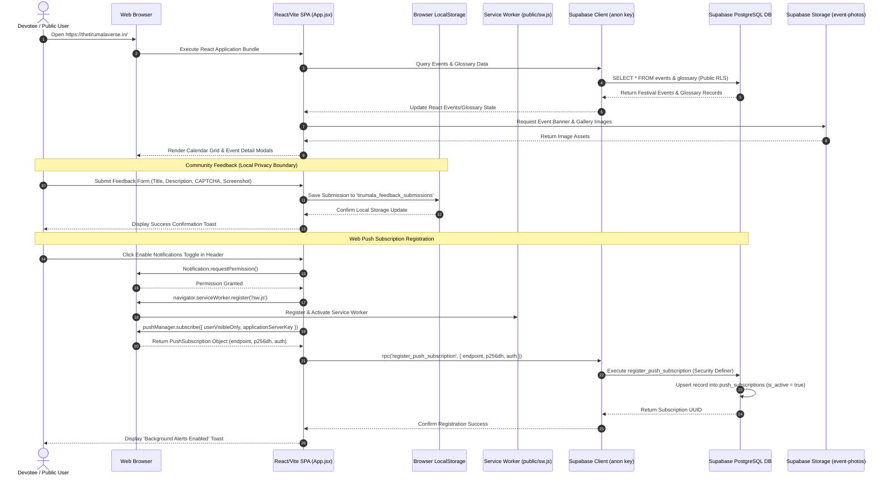
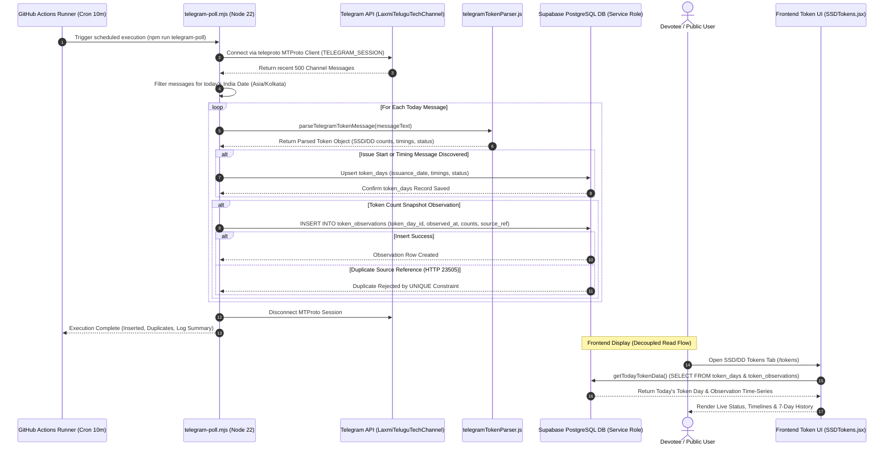
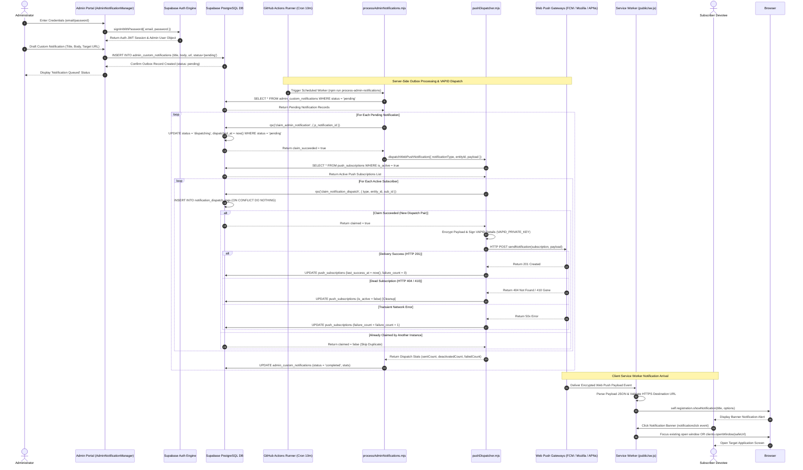

# UML 5 — Sequence Diagrams

## Overview

This document specifies the interaction sequences of **The Tirumala Verse** application across three core operational workflows:
1. **Public User / Application Data Flow**: Client-side asset rendering, Supabase data fetching, LocalStorage privacy isolation, and Web Push subscription registration.
2. **Telegram Token Ingestion Sequence**: Automated 10-minute MTProto polling, regex message parsing, and database persistence.
3. **Admin Web Push Notification Dispatch Sequence**: Outbox notification creation, atomic RPC claiming, VAPID cryptographic signing, push delivery, dead subscription cleanup, and Service Worker notification handling.

---

## 1. Public User / Application Data Flow

This diagram models the execution sequence when a public devotee accesses the application, reads temple events and token data, submits community feedback, and opts into Web Push notifications.

### Flow Explanation
1. **Public Read Query**: The client browser loads the SPA, which executes read-only SELECT queries for events, glossary items, and token days via `supabaseClient.js`.
2. **Media Fetching**: High-resolution festival photos are fetched directly from the public `event-photos` Supabase storage bucket.
3. **Local Feedback Storage**: Community feedback submissions are validated with a CAPTCHA and persisted exclusively inside client `LocalStorage`. No network requests are transmitted to backend servers.
4. **Push Subscription RPC**: Web Push subscription requests generate a browser `PushSubscription` object and invoke the `register_push_subscription` RPC. The Security Definer function inserts or reactivates the endpoint in `push_subscriptions` while bypassing direct client table access restrictions.

---

## 2. Telegram Token Ingestion Sequence

This diagram models the automated backend ingestion pipeline where GitHub Actions periodically polls Telegram for live Tirupati SSD/DD token updates and persists structured observations into Supabase PostgreSQL.

### Flow Explanation
1. **Scheduled Polling**: Every 10 minutes, GitHub Actions triggers `telegram-poll.mjs`.
2. **MTProto API Retrieval**: The script authenticates with Telegram using `TELEGRAM_SESSION` and fetches recent messages from `LaxmiTeluguTechChannel`.
3. **Structured Regex Parsing**: `telegramTokenParser.js` parses remaining token counts, start times, completion times, and status flags.
4. **Database Persistence**: Upserts daily token state into `token_days` and appends time-series snapshots into `token_observations`. Duplicate messages are safely rejected by the database `UNIQUE(source_reference)` constraint.
5. **Decoupled Read**: The frontend queries token tables independently on page load and auto-refreshes every 10 minutes.

> [!IMPORTANT]
> **Pipeline Independence Guarantee**: Telegram token ingestion terminates strictly at Supabase PostgreSQL persistence. `telegram-poll.mjs` does **not** invoke `pushDispatcher.mjs`, and token observations do **not** trigger push notifications. `telegram-worker.mjs` is dormant in production and is not an active sequence participant.

---

## 3. Admin Web Push Notification Dispatch Sequence

This diagram models the outbox notification creation, atomic RPC claiming, VAPID cryptographic payload signing, web push delivery, dead subscription cleanup, and Service Worker notification handling.

### Flow Explanation
1. **Admin Authentication**: The administrator authenticates via Supabase Auth (`signInWithPassword`), obtaining a valid JWT session for RLS-protected database mutations.
2. **Outbox Queueing**: Creating a custom notification inserts a row into `admin_custom_notifications` with `status = 'pending'`.
3. **Atomic Admin Notification Claim**: `processAdminNotifications.mjs` executes via GitHub Actions and calls RPC `claim_admin_notification`. The database atomically transitions `status` to `'dispatching'`, preventing duplicate worker execution.
4. **Atomic Dispatch Log Claim**: `pushDispatcher.mjs` queries active subscriptions. For each endpoint, it executes RPC `claim_notification_dispatch` to insert a record into `notification_dispatch_logs`. If the unique constraint `(notification_type, entity_id, subscription_id)` fails, the dispatch is skipped.
5. **VAPID Payload Signing**: Payloads are encrypted and cryptographically signed using the server-side `VAPID_PRIVATE_KEY` and transmitted over HTTPS to browser Push Gateways.
6. **Dead Subscription Cleanup**: Subscriptions returning HTTP `404` or `410` from push gateways are automatically marked `is_active = false` in `push_subscriptions`.
7. **Service Worker Display & Navigation**: `public/sw.js` handles the background `push` event, displays the notification banner, and handles `notificationclick` by focusing or opening the validated HTTPS destination URL.

---

## Security & Privacy Guarantee

* **Pipeline Separation**: Token ingestion and Web Push outbox processing are completely separate backend pipelines. Token observations do not trigger push notifications.
* **VAPID Key Isolation**: The VAPID private key (`VAPID_PRIVATE_KEY`) is stored exclusively as an encrypted server-side GitHub Actions secret and is never exposed to the client browser.
* **Dormant Worker Exclusion**: `telegram-worker.mjs` is dormant in production and is not included as an active sequence participant.
* **Diagnostic Privacy Guarantee**: Community Feedback is stored strictly in client browser `LocalStorage` (`tirumala_feedback_submissions`). It is not transmitted to Supabase PostgreSQL or any backend deployment node, and does **not** automatically collect browser, operating system, device, user-agent, or page-URL diagnostics.
