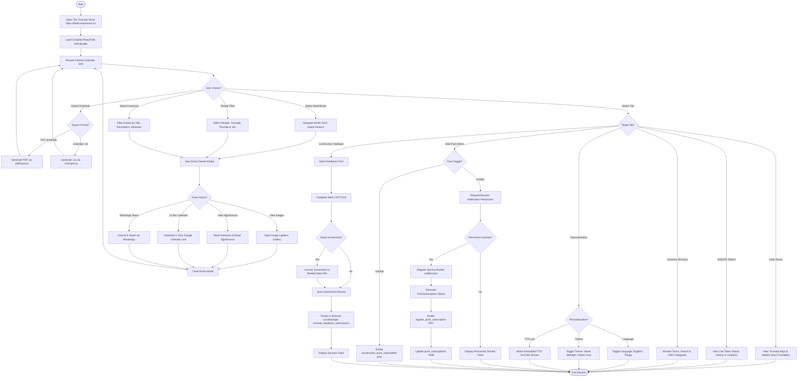
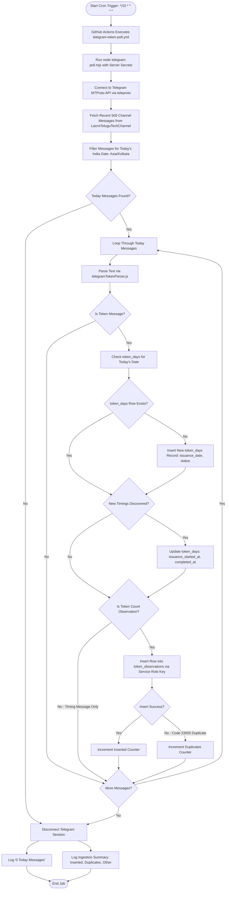
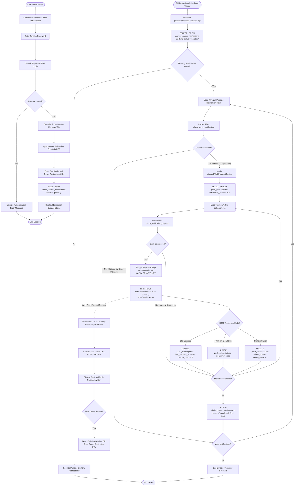

# UML 6 — Activity Diagrams

## Overview

This document specifies the operational activity workflows of **The Tirumala Verse** application across three distinct execution pipelines:
1. **Public User Activity**: End-to-end user navigation, event exploration, schedule exports, bilingual/theme personalization, local feedback submission, and Web Push subscription management.
2. **Telegram Token Ingestion Activity**: Automated GitHub Actions cron polling, Telegram MTProto API retrieval, regex token parsing, database upserts, and duplicate handling.
3. **Admin Web Push Notification Activity**: Administrator authentication, outbox notification queueing, atomic RPC claiming, VAPID payload signing, web push dispatch, dead subscription cleanup, and Service Worker alert handling.

---

## 1. Public User Activity

This diagram details the decision paths and operational workflow of a public devotee visiting the application.

### Flow Explanation
1. **Interactive Event Exploration**: Devotees browse the festival grid, apply temple filters, search titles, or open detailed event popups with options to share via WhatsApp, add to Google Calendar, or export PDF/iCal schedules.
2. **Tab Navigation**: Users transition seamlessly between Daily Sevas timetables, SSD/DD token status, Utsavam glossary searches, and live YouTube streams.
3. **Personalization & Push Opt-In**: Users switch between English/Telugu, toggle Dark/Light themes, or register for Web Push notifications through the `register_push_subscription` RPC.
4. **Local Feedback Privacy**: Submitting community feedback requires a CAPTCHA and optional screenshot attachment. Submissions are persisted strictly inside browser `LocalStorage` (`tirumala_feedback_submissions`). No network data transmission to backend databases occurs.

---

## 2. Telegram Token Processing Activity

This diagram models the automated backend ingestion pipeline executed by GitHub Actions every 10 minutes.

### Flow Explanation
1. **Automated Cron Trigger**: GitHub Actions runs `telegram-poll.mjs` every 10 minutes.
2. **MTProto Retrieval & Regex Parsing**: Fetches recent messages from `LaxmiTeluguTechChannel` and parses token counts, start times, completion times, and status flags using `telegramTokenParser.js`.
3. **Database Upserts & Deduplication**: Inserts daily state into `token_days` and time-series records into `token_observations`. Duplicate messages are safely caught and rejected by the `UNIQUE(source_reference)` constraint (HTTP 23505 duplicate code).

> [!IMPORTANT]
> **Pipeline Independence Guarantee**: Token ingestion runs strictly between Telegram, GitHub Actions, and Supabase PostgreSQL. `telegram-poll.mjs` does **not** call `pushDispatcher.mjs` or `processAdminNotifications.mjs`. Token observations do **not** trigger push notifications. `telegram-worker.mjs` is dormant in production and is not an active activity participant.

---

## 3. Admin Web Push Notification Activity

This diagram models outbox notification creation, administrator authentication, atomic RPC claiming, VAPID payload signing, push delivery, dead subscription cleanup, and Service Worker alert display.

### Flow Explanation
1. **Outbox Creation**: Administrators authenticate via Supabase Auth (`signInWithPassword`) and draft notification payloads, inserting rows into `admin_custom_notifications` with `status = 'pending'`.
2. **Atomic Notification Claiming**: `processAdminNotifications.mjs` runs via GitHub Actions and executes RPC `claim_admin_notification`. The database atomically transitions `status` to `'dispatching'`, eliminating race conditions across concurrent workers.
3. **Atomic Dispatch Log Claiming**: `pushDispatcher.mjs` executes RPC `claim_notification_dispatch` for each subscriber. If inserted into `notification_dispatch_logs`, the claim succeeds; duplicate pairs are safely skipped.
4. **VAPID Delivery & Dead Subscription Cleanup**: Payloads are cryptographically signed using the server-side `VAPID_PRIVATE_KEY` and transmitted to push gateways. Gateways returning HTTP `404` or `410` trigger immediate cleanup, marking subscriptions `is_active = false`.
5. **Service Worker Display**: `public/sw.js` handles the background `push` event, displays the notification banner, and handles `notificationclick` navigation to the validated HTTPS URL.

---

## Security & Privacy Guarantee

* **Pipeline Independence**: Telegram token ingestion and Web Push outbox processing are completely independent backend pipelines. Token observations do not trigger push notifications.
* **Server-Side VAPID Key Isolation**: The VAPID private key (`VAPID_PRIVATE_KEY`) is stored exclusively as an encrypted secret in GitHub Actions and is never exposed to client browsers.
* **Dormant Worker Exclusion**: `telegram-worker.mjs` is dormant in production and is not included as an active activity participant.
* **Diagnostic Privacy Guarantee**: Community Feedback is stored strictly in client browser `LocalStorage` (`tirumala_feedback_submissions`). It is not transmitted to Supabase PostgreSQL or any backend deployment node, and does **not** automatically collect browser, operating system, device, user-agent, or page-URL diagnostics.
