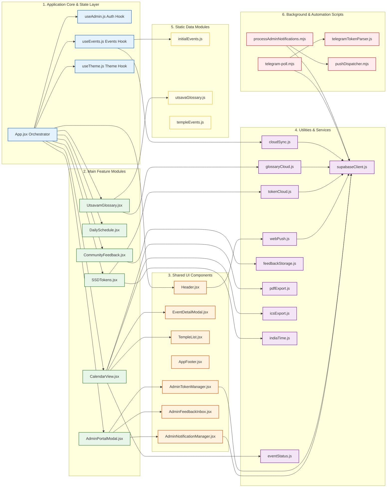

# UML 7 — Class / Module Architecture Diagram

## Overview

This **UML-style Class / Module Architecture Diagram** visualizes the software structure, component modularity, utility dependencies, data layers, and backend automation scripts of **The Tirumala Verse**. Because the application frontend is implemented using modern functional React components, custom hooks, and modular JavaScript files rather than traditional object-oriented class inheritance, this document models the application's true modular architecture without inventing artificial classes, constructors, or methods.

---

## Module Responsibilities

| Module / File | Type | Architectural Responsibility |
| :--- | :--- | :--- |
| **`App.jsx`** | React Component | Root application orchestrator managing tab routing (`window.history`), global theme/language state, initial data loading, modal toggles, and top-level layout rendering. |
| **`useAdmin.js`** | Custom React Hook | Manages admin authentication state (`isAdminLoggedIn`), Supabase Auth session listeners (`onAuthStateChange`), and `login`/`logout` methods. |
| **`useEvents.js`** | Custom React Hook | Manages dynamic temple events state, merging initial offline defaults with Supabase cloud overrides and local edits. |
| **`useTheme.js`** | Custom React Hook | Handles visual theme persistence (`tirumala_theme_mode`), toggling between *Velvet Midnight* (Dark) and *Warm Ivory* (Light) modes. |
| **`CalendarView.jsx`** | React Component | Main festival calendar interface rendering month grid views, schedule lists, search filters, temple selectors, and PDF/iCal export triggers. |
| **`DailySchedule.jsx`** | React Component | Renders daily Tirumala Nitya Seva timetables, weekly special sevas, and Anna Prasadam details. |
| **`SSDTokens.jsx`** | React Component | SSD and DD token dashboard displaying real-time live status, 7-day token history, issuance locations, and pilgrim requirements. |
| **`UtsavamGlossary.jsx`** | React Component | Cultural festival glossary browser providing keyword search, category filtering, bilingual terms, and admin term edit dialogs. |
| **`CommunityFeedback.jsx`** | React Component | Devotee feedback submission form featuring math CAPTCHA verification, optional image attachment processing, and local storage saving. |
| **`AdminPortalModal.jsx`** | React Component | Central administrative modal container hosting admin login, feedback inbox, notification manager, event editor, glossary editor, and token manager. |
| **`Header.jsx`** | React Component | Top navigation bar rendering logo, navigation links, live India clock, language/theme toggles, and push alert subscription triggers. |
| **`EventDetailModal.jsx`** | React Component | Detailed modal popup displaying event timing, Vahanam details, image gallery lightboxes, WhatsApp sharing, and Google Calendar export triggers. |
| **`AdminNotificationManager.jsx`** | React Component | Admin notification center for drafting custom push broadcasts, querying active subscriber counts, and monitoring outbox execution metrics. |
| **`supabaseClient.js`** | Supabase Integration | Initializes the Supabase client instance using public environment credentials (`VITE_SUPABASE_URL`, `VITE_SUPABASE_ANON_KEY`). |
| **`webPush.js`** | Utility Module | Manages browser Web Push capability checks, VAPID key encoding, Service Worker registration, and Supabase subscription RPC invocations. |
| **`tokenCloud.js`** | Utility Module | Interacts with Supabase PostgreSQL to fetch today's token day, time-series observations, and 7-day token history. |
| **`glossaryCloud.js`** | Utility Module | Handles cloud synchronization for glossary terms (pulling from, saving to, and deleting from Supabase `glossary` table). |
| **`cloudSync.js`** | Utility Module | Manages cloud synchronization for temple events (pulling from, updating, and deleting from Supabase `events` table). |
| **`feedbackStorage.js`** | Utility Module | Provides `loadStoredFeedback` and `saveStoredFeedback` functions to manage devotee feedback submissions in client browser `LocalStorage`. |
| **`pdfExport.js`** | Utility Module | Generates downloadable PDF festival schedule documents client-side using `jspdf` and `jspdf-autotable`. |
| **`icsExport.js`** | Utility Module | Generates `.ics` iCalendar calendar event files client-side for calendar integration. |
| **`indiaTime.js`** | Utility Module | Provides timezone helper utilities for calculating exact India Standard Time (`Asia/Kolkata`) dates and timestamps. |
| **`telegramTokenParser.js`** | Utility Module | Regex parsing engine extracting structured SSD/DD remaining counts, issue start times, completion timestamps, and status flags from raw Telegram message text. |
| **`telegram-poll.mjs`** | Background Script | Automated Node.js script executed by GitHub Actions every 10 minutes to poll Telegram MTProto servers, parse token updates, and persist rows in Supabase. |
| **`processAdminNotifications.mjs`** | Background Script | Automated Node.js script executed by GitHub Actions to query pending outbox notifications, claim rows atomically via RPC, and invoke the push dispatcher. |
| **`pushDispatcher.mjs`** | Background Script | Server-side Web Push module handling VAPID cryptographic signing, atomic dispatch logging, sending HTTP push requests, and cleaning up dead subscriptions. |

---

## Important Dependencies & Architecture Flows

1. **Application Core to Feature Modules**:
   * `App.jsx` acts as the central state orchestrator, instantiating custom hooks (`useEvents`, `useAdmin`, `useTheme`) and conditionally rendering top-level feature components (`CalendarView`, `DailySchedule`, `SSDTokens`, `UtsavamGlossary`, `CommunityFeedback`, `AdminPortalModal`).
2. **Feature Components to Utilities & Services**:
   * `SSDTokens.jsx` depends on `tokenCloud.js` for querying token state and `indiaTime.js` for Wednesday non-issuance rules.
   * `CalendarView.jsx` depends on `pdfExport.js`, `icsExport.js`, and `eventStatus.js` for exports and status calculations.
   * `CommunityFeedback.jsx` depends strictly on `feedbackStorage.js` to persist submissions in client browser `LocalStorage`.
3. **Frontend to Supabase Database**:
   * Frontend modules (`webPush.js`, `tokenCloud.js`, `glossaryCloud.js`, `cloudSync.js`) import `supabaseClient.js` to interact with Supabase database tables (`events`, `glossary`, `token_days`, `token_observations`) and execute `SECURITY DEFINER` RPCs using the public anonymous key.
4. **Independent Automation Pipelines**:
   * **Telegram Token Pipeline**: `telegram-poll.mjs` imports `telegramTokenParser.js` and `@supabase/supabase-js`. It operates completely independently of Web Push.
   * **Admin Web Push Pipeline**: `processAdminNotifications.mjs` imports `pushDispatcher.mjs` and `@supabase/supabase-js`. It processes custom outbox rows in `admin_custom_notifications` and dispatches encrypted payloads to vendor push gateways.

> [!IMPORTANT]
> **Pipeline Independence Guarantee**: Telegram token ingestion and Web Push notification processing are completely independent pipelines. `telegram-poll.mjs` does **not** import or invoke `pushDispatcher.mjs`. Token observations do **not** trigger push notifications.

---

## Security & Privacy Guarantee

* **No Object-Oriented Inheritance Misrepresentation**: The application relies on functional React components, custom hooks, and modular ES utilities. No artificial classes, constructors, or inheritance hierarchies are modeled.
* **Dormant Worker Exclusion**: `telegram-worker.mjs` is dormant in production and is not listed as an active production module.
* **VAPID Key Isolation**: Server-side Web Push dispatch (`pushDispatcher.mjs`) uses the server-side VAPID private key (`VAPID_PRIVATE_KEY`) within GitHub Actions. The frontend `webPush.js` utility uses only the VAPID public key (`VITE_VAPID_PUBLIC_KEY`).
* **Diagnostic Privacy Guarantee**: Community Feedback is managed by `feedbackStorage.js` and stored strictly in client browser `LocalStorage` (`tirumala_feedback_submissions`). It is **not** transmitted to Supabase PostgreSQL or any backend database module, and does **not** automatically collect browser, operating system, device, user-agent, or page-URL diagnostics.
